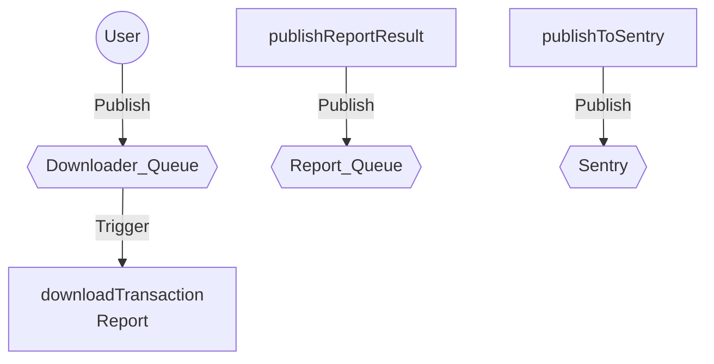

# mermaind-playground

    
Download Report

    

```mermaid
    flowchart TB
    User((User)) -- Publish --> Downloader_Queue
    Downloader_Queue{{Downloader_Queue}} -- Trigger --> downloadTransaction\nReport
  
    
    publishReportResult -- Publish --> Report_Queue{{Report_Queue}}
    publishToSentry -- Publish --> Sentry{{Sentry}}

```

